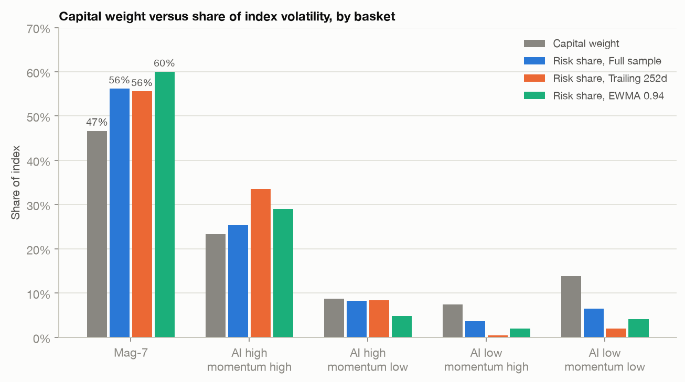
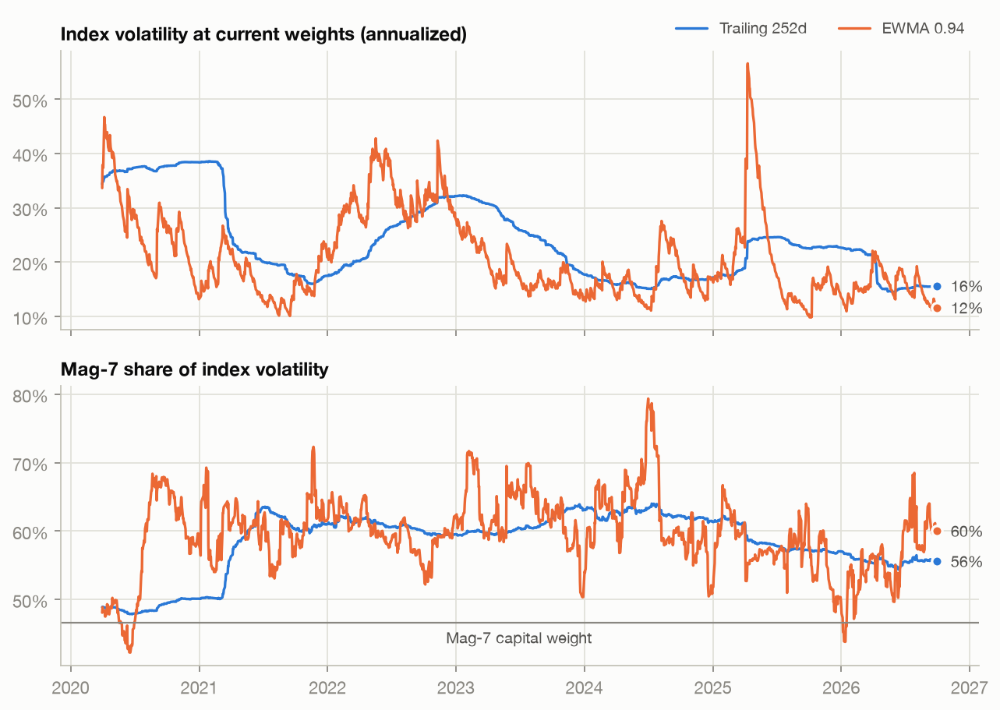
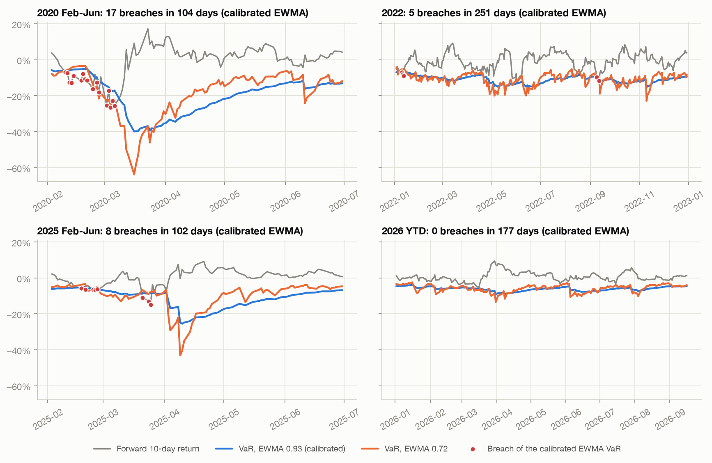
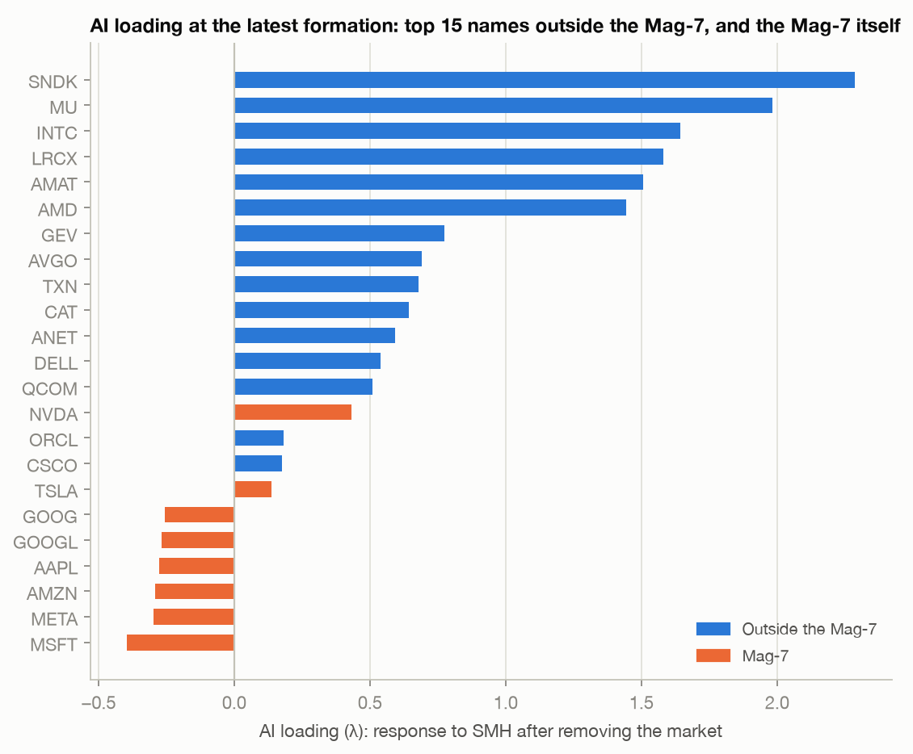
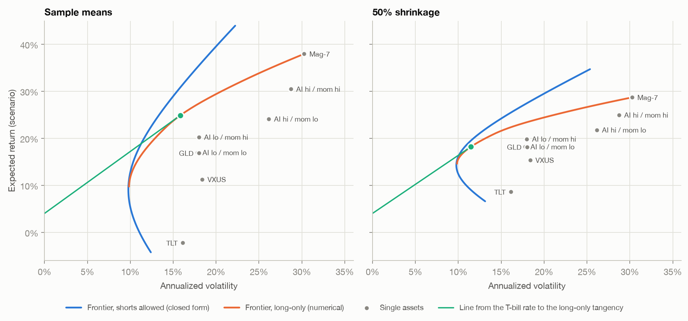

# quiet-index

A reproducible study of concentration, AI-factor exposure, covariance-estimator sensitivity and VaR backtesting in the S&P 100. Results are through **30 September 2026**.

**Thesis.** The S&P 100 looks quiet and is concentrated at the same time, and a standard risk report shows the first far more clearly than the second. Short-memory estimators put its volatility at 11.6%–15.6%, near the bottom of their range since March 2020, while 70.0% of its capital and 81.6%–89.1% of its volatility sit in two baskets with a 0.80 correlation between them. The shape of that decomposition barely moves with the estimator, but the level of risk roughly doubles with a longer memory, and on SPY the parametric-normal VaR built on short lookbacks was breached 75–111 times since 2014 against about 32 expected.

- **Risk is more concentrated than capital.** The Mag-7 holds **46.6%** of index capital and contributes **55.6%–60.0%** of index volatility under every covariance estimator tested.
- **The level of risk is a choice of memory.** The same portfolio on the same day measures **24.1%** annualized volatility on the full sample, **15.6%** on the trailing year and **11.6%** on EWMA with λ = 0.94.

Nothing here forecasts a drawdown or a return. The claim is about measurement: which parts of a current risk report on this index can be trusted, and which depend on the calm continuing.



Self-directed research project by Sai Reddivari alongside the CQF.

## The argument in four findings

### 1. Risk sits in two baskets, and that result is stable

The Mag-7 basket is seven companies represented by eight tickers, because both Alphabet share classes are included. Combining it with the high-AI-loading, high-momentum basket produces **70.0% of current capital** and **81.6%–89.1% of index risk**. The two low-AI baskets hold 21.3% of capital and 2.5%–10.1% of risk.

*For someone measuring risk:* capital weight understates concentration, and the ordering of the baskets by risk per unit of capital holds whichever lookback is used.

### 2. The level of risk depends on how quickly the estimator forgets

| Estimator | Index volatility | 10-day 99% VaR | Mag-7 risk share |
|---|---:|---:|---:|
| Full sample | 24.1% | −11.2% | 56.2% |
| Trailing 252 days | 15.6% | −7.2% | 55.6% |
| EWMA 0.94 | 11.6% | −5.4% | 60.0% |

Nothing about the portfolio differs between the rows. The trailing-year figure is lower than on 91% of days since March 2020 and the EWMA figure lower than on 97%, which is the sense in which the index is quiet. SPY shows the same pattern: its current 10-day 99% VaR ranges from **3.7% to 7.8%** solely because estimator memory ranges from a two-day half-life to the full sample since 2013.

*For someone measuring risk:* the shape of the decomposition deserves more confidence than its level, and the gap between the short-memory and long-memory figures measures how much of today's number depends on the recent calm.



### 3. Parametric-normal VaR on short lookbacks under-covers

Breaches of a 10-day 99% VaR on SPY, by volatility model:

| Window | Rolling 21d | EWMA 0.72 | EWMA 0.93 | GARCH(1,1) |
|---|---:|---:|---:|---:|
| Feb–Jun 2020 | 17 | 13 | 17 | 17 |
| 2022 | 6 | 12 | 5 | 13 |
| Feb–Jun 2025 | 10 | 10 | 8 | 8 |
| 2026 YTD | 0 | 0 | 0 | 0 |
| Full period | 96 | 111 | 81 | 75 |

The full-period target is approximately 32 breaches. All four models finish in the red zone. Repeating the test on ten sets of non-overlapping 10-day observations reduces mechanical breach clustering but does not remove the under-coverage. No model is best in every window, and in 2020 and 2025 the breaches fall in the first weeks of the episode, on VaR figures set while the trailing window was still calm (notebook 04).

*For someone measuring risk:* a VaR produced by a short-memory estimator after a quiet period is the figure that has been least reliable in this sample, and 2026 to date is such a period.



### 4. AI loading locates the risk better than momentum, but not better than beta

AI loading is substantially more informative than momentum about next-quarter marginal risk contribution: its average rank correlation is **0.69**, versus **0.17** for momentum, and it wins in **28 of 30 quarters**. Ordinary market beta remains stronger at **0.77**. AI-related co-movement extends beyond the Mag-7, but narrowly: **13 companies outside the Mag-7 have an AI loading above 0.5**, representing **14.4% of current index weight** and concentrated largely in semiconductors, memory, networking and power equipment.

*For someone measuring risk:* the AI sort describes where marginal risk sits, but part of what it captures is ordinary beta, and on this evidence it is not a separate risk factor.



**A supporting result on allocation.** The covariance matrix says where the risk is and little about what to hold. Mean-variance allocations are much more sensitive to expected-return assumptions than to the covariance mechanics: in the long-only portfolios, the Mag-7 allocation moves from **34% to 12% to 0%** as the return assumption moves from sample means to shrunk means to no views.

## What I'd test next

Open questions that follow from the findings. Each has an outcome that would change the reading above.

1. **Is the under-coverage a tail problem or a timing problem?** If a Student-t or filtered-historical-simulation VaR on the same volatility models brings the breach count back to target, the fault is the normal quantile. If breaches still arrive in the first weeks of each episode, the fault is the conditioning volatility. The same question applies to the S&P 100 portfolio and to expected shortfall, which the current backtest does not cover.
2. **Does the gap between short- and long-memory estimates say anything about model reliability?** If breach rates are no higher after days when the fast estimate sits far below the slow one, the gap only describes the present and finding 2 loses most of its practical use.
3. **Does the decomposition survive point-in-time membership and weights?** Every result uses current members and the 1 October 2026 weights. The Mag-7's excess of risk share over capital weight may shrink or vanish in earlier years once historical weights are restored.
4. **Does AI loading explain anything once beta is controlled for?** A partial rank correlation, and a proxy that is not a semiconductor ETF, would show whether the loading is a distinct exposure or a noisier measure of beta. The existing NVDA-proxy check agrees less with SMH in the latest formations than over the history, which is a reason to ask.
5. **How much diversification from the low-AI baskets survives stress?** They carry 2.5% of risk on the trailing year and 10.1% on the full sample. A covariance estimated on the stress windows alone, or implied from options, would show whether today's concentration figure is typical or a calm-period reading.
6. **Does risk concentration lead or lag realized drawdowns?** This study does not answer that, and the question needs the point-in-time reconstruction in item 3 before it can be asked properly.

## Research design

### 1. Universe, factors and baskets

The study fixes the current S&P 100 membership over history and divides it into five non-overlapping baskets:

| Basket | Construction |
|---|---|
| `M7` | AAPL, MSFT, NVDA, AMZN, GOOGL, GOOG, META and TSLA |
| `AI_HI_MOM_HI` | Above-median AI loading and above-median momentum |
| `AI_HI_MOM_LO` | Above-median AI loading and below-median momentum |
| `AI_LO_MOM_HI` | Below-median AI loading and above-median momentum |
| `AI_LO_MOM_LO` | Below-median AI loading and below-median momentum |

The sorting variables are estimated at each completed calendar quarter-end:

- **Market beta:** OLS slope of the stock’s daily return on SPY over the trailing 252 trading days.
- **AI loading (λ):** the stock’s exposure to SMH after the market component has been removed from both series. By Frisch–Waugh–Lovell, this equals the SMH coefficient in a joint regression on SPY and SMH.
- **Momentum:** the trailing 252-day price return excluding the most recent 21 trading days.

Each formation uses only information available on that date and governs the following quarter, so membership is reconstructed quarterly without look-ahead. Constituent weights come from the **1 October 2026 OEF snapshot** and are reused throughout, renormalized within each basket across the members with a return that day. The basket-return history runs from **1 April 2019 through 30 September 2026**.

“AI high” means above the cross-sectional median, not necessarily positive AI exposure. At the latest formation, the median AI loading outside the Mag-7 is negative.

### 2. Covariance estimation and risk decomposition

The latest basket assignment and current capital weights are evaluated under three annualized covariance estimators: full sample, trailing 252 trading days, and EWMA with λ = 0.94 (approximately an 11-day half-life). For weights \(w\) and covariance matrix \(\Sigma\):

\[
\sigma_p=\sqrt{w^\top\Sigma w}
\]

\[
\mathrm{MCR}_i=\frac{(\Sigma w)_i}{\sigma_p}
\]

\[
\mathrm{ComponentRisk}_i=w_i\mathrm{MCR}_i
\]

Component risks satisfy the Euler identity and sum to total portfolio volatility. Risk share is component risk divided by portfolio volatility. The historical risk chart holds today’s basket weights fixed and runs them through each date’s covariance estimate, so it compares estimator behavior through time and does not reconstruct the index’s historical composition.

### 3. Mean-variance context

The five baskets are combined with three diversifiers (`VXUS`, `TLT`, `GLD`). The project computes the closed-form efficient frontier with an independent SLSQP check, unconstrained and long-only tangency portfolios, long-only portfolios at 12% and 18% volatility targets, and minimum-variance portfolios with no return views. Expected returns are scenarios, not forecasts: historical sample means, 50% shrinkage toward the cross-sectional grand mean, and no relative views.



### 4. VaR backtesting

Four volatility models are compared on SPY: rolling 21-day volatility, fast EWMA with λ = 0.72, EWMA with λ = **0.93** (selected by one-step QLIKE variance-forecast loss over 2014–2019), and expanding-window GARCH(1,1) re-estimated every 21 trading days. Conventions:

- 99% confidence, 10-trading-day horizon; VaR on day \(t\) uses returns available through day \(t\)
- Realized return is \(\ln(S_{t+10}/S_t)\); a breach occurs when it falls below VaR
- Zones use Binomial(\(T,0.01\)) percentiles; formal checks use Kupiec coverage and Christoffersen independence tests

## Repository guide

| Path | Purpose |
|---|---|
| [`notebooks/`](notebooks/) | Four numbered notebooks, one per research-design section (`01_universe_factors_baskets`, `02_risk_decomposition`, `03_mean_variance`, `04_var_backtest`), each ending in a written conclusion |
| [`src/quiet_index/`](src/quiet_index/) | Reusable analysis package |
| [`scripts/download_data.py`](scripts/download_data.py) | Downloads and caches the raw market data |
| [`scripts/run_analysis.py`](scripts/run_analysis.py) | Runs all four sections and writes every table and figure |
| [`results/`](results/) | Committed CSV outputs behind the reported numbers |
| [`figures/`](figures/) | Committed publication-ready figures |
| [`tests/`](tests/) | Closed-form and simulated-data estimator checks |
| [`data/reference/`](data/reference/) | Fixed membership and dated holdings-weight snapshots |
| [`results/data_manifest.json`](results/data_manifest.json) | Data sources, pull timestamp and effective study date |

The notebook in [`notebooks/archive/`](notebooks/archive/) is the original exploratory implementation, retained for provenance; it is not maintained and should not be used to reproduce current results.

## Data

- **Membership:** 101 tickers representing 100 S&P 100 companies, snapshotted on 31 August 2026 from the [iShares OEF holdings file](https://www.ishares.com/us/products/239723/ishares-s-p-100-etf/latest-holdings.csv).
- **Capital weights:** a separate OEF snapshot dated 1 October 2026, normalized to sum to one.
- **Prices:** Yahoo Finance adjusted closes, from 2018 for members and benchmarks and from 2013 for SPY and the 13-week T-bill.
- **Study cutoff:** 30 September 2026, regardless of later dates present in the downloaded cache.
- **Benchmarks:** SMH, NVDA, MAGS, VXUS, TLT, GLD, SPY and `^IRX`.

Raw prices are cached as Parquet under `data/raw/` and excluded from version control; the committed manifest records what was downloaded.

## Reproduce the analysis

Python 3.11 or later is required.

```bash
git clone https://github.com/sai-reddivari/quiet-index.git
cd quiet-index

python -m venv .venv
source .venv/bin/activate

python -m pip install -e ".[dev]"
python scripts/download_data.py
python scripts/run_analysis.py
```

This writes all tables to `results/` and all figures to `figures/`. Add `--no-figures` to regenerate tables only, or run `jupyter lab` and open the notebooks in order. `python scripts/download_data.py --refresh-weights` creates a new dated holdings snapshot; update `WEIGHTS_FILE` in `src/quiet_index/config.py` to make it the active input.

## Tests

The repository contains 18 tests, run with `pytest -q`. They cover OLS recovery and residual orthogonality; equivalence of the two-stage and joint AI-loading estimates; minimum-observation and formation-date rules; basket assignment and missing-member reweighting; EWMA recursion and half-life calculations; positive-definite covariance output; closed-form versus numerical frontier solutions; Euler risk decomposition; analytical VaR and ES sensitivities; Kupiec and Christoffersen behavior; and prevention of look-ahead in volatility estimates.

## Interpretation and limitations

- Current membership is projected backward, creating survivorship bias. Historical returns are descriptive and are not performance claims.
- Basket membership is reconstructed quarterly, but constituent weights are not: the 1 October 2026 OEF weights are reused throughout. The basket series are returns to changing characteristic groups under constant constituent weights, not reconstructions of historical OEF or S&P 100 returns.
- The baskets are quarterly characteristic portfolios, not permanent company groups. Roughly one-third of names change basket at a typical formation.
- AI loading measures residual co-movement with SMH after removing SPY. It is not a fundamental measure of a company’s AI revenue or strategy.
- Clustering on residual stock returns does not reproduce the baskets. They should be interpreted as factor sorts, not naturally occurring return clusters.
- The two off-diagonal baskets can contain relatively few companies, making their estimates noisier.
- Expected returns in the optimization section are deliberately presented as scenarios.
- VaR and ES are parametric-normal. The observed return distribution is negatively skewed and heavy-tailed.
- The VaR backtest is run on SPY, not on the S&P 100 basket portfolio. Most backtest observations use overlapping 10-day returns; a separate non-overlapping analysis is included.
- The analysis excludes transaction costs, taxes, liquidity constraints and turnover penalties.

This is a risk-analytics study, not investment advice.

## License

MIT License. See [`LICENSE`](LICENSE).

Analysis code and results are my own; some project scaffolding was AI-assisted.

*Sai Reddivari · 2026*
